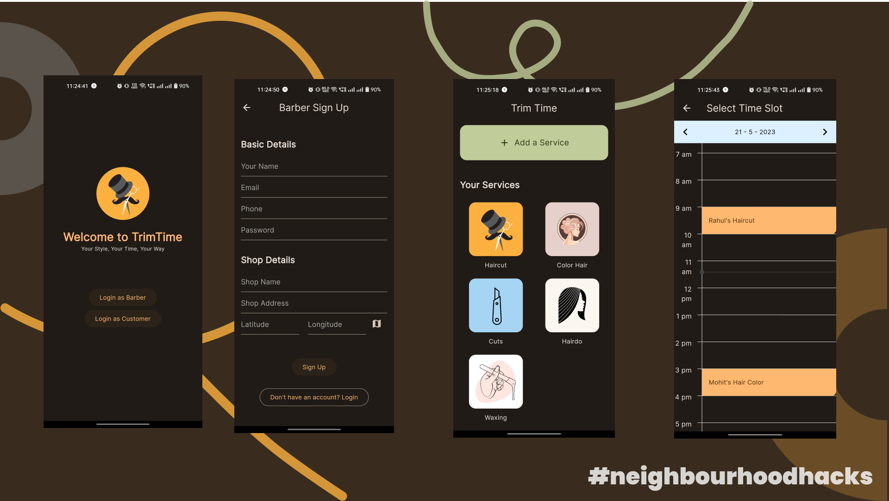
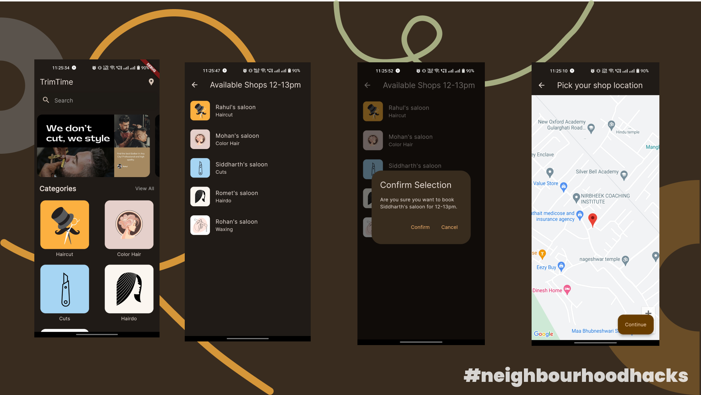

## Inspiration 💡

The inspiration behind our barber application came from the frustration of waiting for haircuts and the desire to provide a more efficient solution. We aimed to address the pain points of long wait times and enhance the overall experience for customers and barbershops.

## What it does 📲✂️

Our barber application revolutionizes the haircut booking process. Users can register seats in advance, eliminating the hassle of waiting. The app optimizes barber schedules, reducing wait times ⏳. Real-time updates keep users informed about available slots, while personalized profiles enable customization. Notifications and reminders ensure users never miss appointments 📅. Customer reviews and ratings promote transparency and trust, while loyalty programs and special offers encourage retention.

## How we built it 🛠️

We built the application using a robust tech stack:

- **Flutter**  for cross-platform compatibility.
- **NodeJS** with **Express** for server-side development.
- **MongoDB** and **Mongoose** for efficient data storage.
- **TypeScript** for type-safe and maintainable code.
- _We followed best practices on GitHub for efficient collaboration and code reviews_

## Accomplishments we are proud of 🏆

- We take pride in achieving a production-quality codebase and utilizing best practices on GitHub. Developing type-safe code using TypeScript enhanced maintainability. Integrating external loyalty programs improved the customer experience and fostered retention.

## What we learned 📚
- **Building Scalable and Secure Applications**: We learned the importance of designing and developing applications that can handle increasing user demand and scale effectively. We focused on creating a scalable architecture that could accommodate a growing user base while ensuring data security and privacy.
- **Type Safety with TypeScript**: Leveraging TypeScript for development provided us with the benefits of type safety. We learned how to write code that catches potential type-related errors early, improving overall code quality and maintainability. TypeScript helped us write robust and reliable code, reducing the likelihood of runtime errors.

## What's next 🔜

- Moving forward, we plan to enhance the application by integrating online payment options, implementing geolocation-based search for nearby barbershops, and creating a comprehensive analytics dashboard for barbershop owners. Our goal is to expand our user base, onboard more barbershops, and establish ourselves as the go-to platform for hassle-free haircut bookings.

## Screenshots

